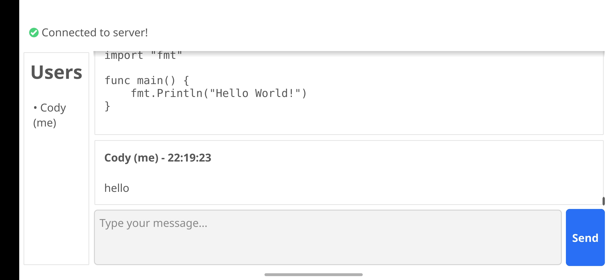

# marchat GUI Client



Cross-platform desktop client for marchat chat server with real-time messaging, file sharing, and end-to-end encryption support.

## Features

- Real-time WebSocket-based messaging
- File sharing with configurable size limits
- End-to-end encryption with keystore management
- Multiple UI themes (light, dark, system)
- Admin functionality for user and database management
- Cross-platform support (Windows, macOS, Linux)
- 12/24 hour time format options
- Audio notifications with mention filtering
- Markdown support for code snippets
- Auto-reconnection with exponential backoff

## Requirements

- Go 1.23 or later
- Compatible marchat server instance

## Dependencies

- [Fyne v2](https://fyne.io/) - GUI framework
- [Gorilla WebSocket](https://github.com/gorilla/websocket) - WebSocket client
- marchat/client/config - Configuration management
- marchat/client/crypto - Encryption support
- marchat/shared - Shared data structures

## Installation

```bash
go build -o marchat-gui main.go
```

## Configuration

### Interactive Setup

Run without arguments to open the configuration dialog:

```bash
./marchat-gui
```

### Configuration Options

- **Username**: Display name for chat
- **Server URL**: WebSocket server endpoint (default: ws://localhost:8080/ws)
- **Admin Access**: Enable admin privileges with key
- **End-to-End Encryption**: Enable with keystore passphrase
- **Global E2E Key**: Set via MARCHAT_GLOBAL_E2E_KEY environment variable
- **Theme**: system, light, or dark

### Keystore Location

Keystores are stored following OS conventions:
- **Linux/macOS**: `~/.config/marchat/keystore.dat`
- **Windows**: `%APPDATA%\marchat\keystore.dat`

## Usage

### Chat Commands

```
:clear              Clear chat history
:time               Toggle 12/24h time format
:bell               Toggle notification sounds
:bell-mention       Toggle mention-only notifications
:code               Create code snippet dialog
:sendfile [path]    Send file to chat
:savefile <name>    Save received file
:theme <name>       Change theme
```

### Admin Commands

```
:cleardb            Clear message database
:backup             Backup database
:stats              Show database statistics
:kick <user>        Kick user from chat
:ban <user>         Ban user permanently
:unban <user>       Remove user ban
:allow <user>       Override kick/ban
:forcedisconnect <user>  Force disconnect user
```

### File Sharing

File size limits are configured via environment variables:
- `MARCHAT_MAX_FILE_BYTES`: Maximum file size in bytes
- `MARCHAT_MAX_FILE_MB`: Maximum file size in megabytes

Default limit is 1MB.

### Menu Navigation

**File Menu**
- Send File: Open file picker
- Save Received File: Save files from chat
- Quit: Close application

**Edit Menu**
- Clear Chat: Remove message history
- Code Snippet: Create formatted code blocks

**View Menu**
- Toggle Time Format: Switch time display
- Theme Selection: Change appearance

**Audio Menu**
- Toggle Bell: Enable/disable notifications
- Toggle Bell on Mention Only: Filter notifications

## Encryption

The client supports end-to-end encryption when properly configured:

1. Enable encryption in configuration dialog
2. Provide keystore passphrase
3. Set global encryption key via environment variable
4. Existing keystores from CLI client are compatible

## Admin Features

Admin users can:
- View and manage connected users
- Execute database operations
- Kick, ban, or force disconnect users
- Access server statistics
- Perform database backups

Admin selection in user list enables context actions.

## Keyboard Shortcuts

- **Enter**: Send message
- **Ctrl+Enter**: New line in message entry

## Logging

Debug logs are written to `marchat-gui-debug.log` in the working directory.

## Environment Variables

```bash
MARCHAT_GLOBAL_E2E_KEY    # Global encryption key (base64)
MARCHAT_MAX_FILE_BYTES    # File size limit in bytes
MARCHAT_MAX_FILE_MB       # File size limit in megabytes
```

## Connection Handling

- Automatic reconnection on connection loss
- Exponential backoff with maximum 30-second delay
- WebSocket ping/pong for connection health
- TLS verification disabled by default for development

## Build Options

For production builds, consider:

```bash
go build -ldflags="-s -w" -o marchat-gui main.go
```

## Troubleshooting

**Connection Issues**
- Verify server URL and accessibility
- Check firewall settings
- Review debug logs

**Encryption Problems**
- Confirm keystore passphrase
- Verify MARCHAT_GLOBAL_E2E_KEY environment variable
- Check keystore file permissions

**File Transfer Failures**
- Verify file size limits
- Check file permissions
- Ensure sufficient disk space

## License


This project is licensed under the MIT License - see the [LICENSE](LICENSE) file for details.

